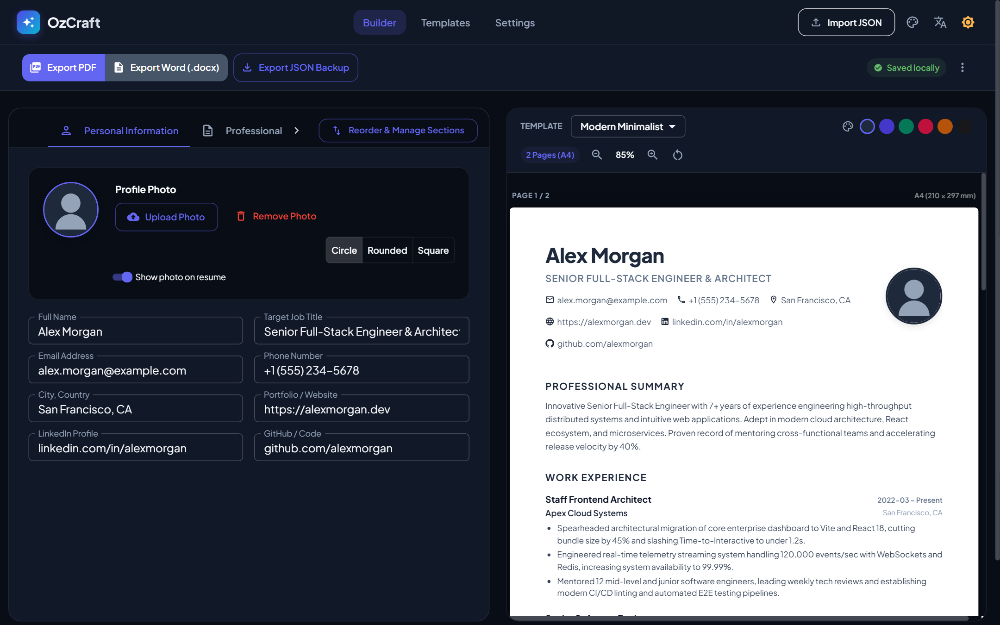
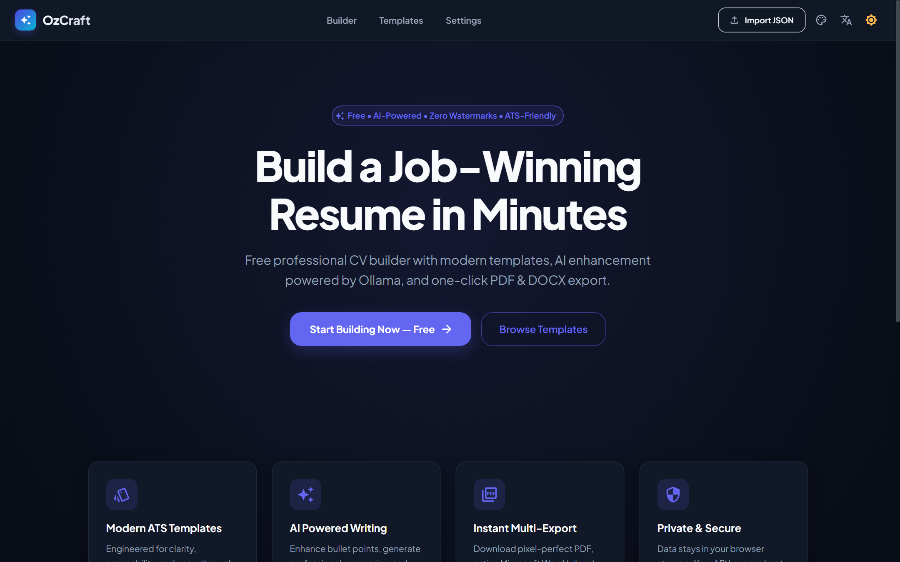
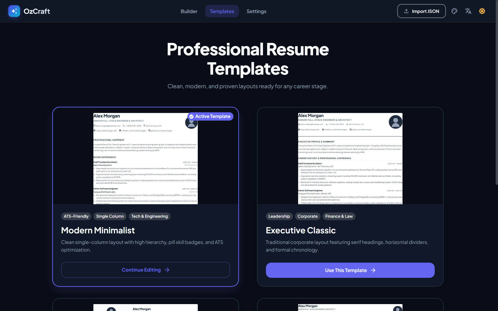
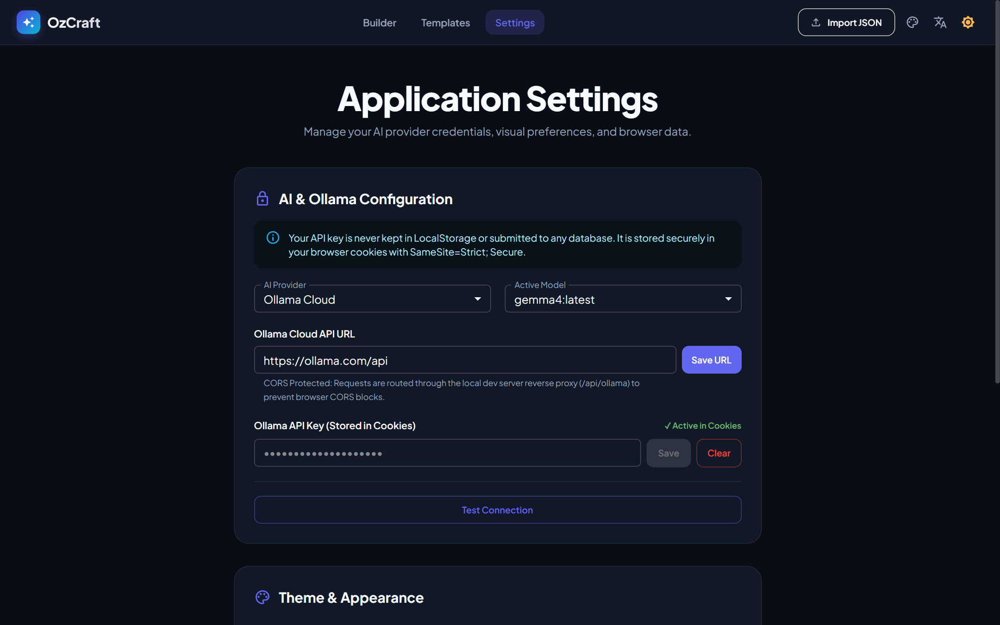

# OzCraft — AI Resume Builder

<p align="center">
  
</p>

<p align="center">
  <b>A modern, privacy-first, ATS-friendly resume builder with real-time preview, intelligent AI assistance, and seamless multi-format exports.</b>
</p>

<p align="center">
  
  
  
  
  
  
</p>

---

## 🌟 Overview

**OzCraft Resume Builder** is an open-source, client-side web application designed to help job seekers, engineers, and professionals build ATS-optimized resumes in minutes.

Unlike conventional resume tools that lock your data behind paywalls or place watermarks on your work, OzCraft gives you **complete control and 100% data ownership**:

- **Client-First & Privacy-Focused**: Your personal data never leaves your device. All data is saved in your browser storage, and AI API keys are stored securely using HTTP cookie flags.
- **Zero Watermarks & Paywalls**: Free, open, and unrestricted PDF & Word downloads.
- **AI-Powered Polish**: Connect effortlessly to Ollama (Cloud or Local) to optimize bullet points, tailor executive summaries, and eliminate grammatical errors.
- **Tailored Templates**: Switch between multiple ATS-compliant layouts with a single click.

---

## 📸 Application Previews

### 1. Live Builder & Split Preview

Real-time two-way synchronization: edit your details on the left, watch your resume adapt instantly on the right with responsive zoom and page break indicators.



---

### 2. Modern Landing Experience

Clean, distraction-free entry point to start from scratch or pick up where you left off.



---

### 3. Template Catalog

Choose from multiple professionally designed, ATS-friendly templates tailored for tech, executive, creative, and academic roles.



---

### 4. Privacy & AI Settings

Configure local or cloud AI models (Ollama, Gemma, etc.) with customizable endpoints and encrypted browser cookie storage.



---

## 🛠️ Tech Stack

| Category                 | Technology                                                                           | Description                                                                           |
| :----------------------- | :----------------------------------------------------------------------------------- | :------------------------------------------------------------------------------------ |
| **Frontend Core**        | [React 19](https://react.dev/)                                                       | Component architecture utilizing the latest React 19 hooks and concurrent features    |
| **Build & Tooling**      | [Vite 8](https://vite.dev/)                                                          | Lightning-fast HMR, optimized ESM bundling, and instant dev server startup            |
| **Component Library**    | [Material UI v9](https://mui.com/)                                                   | Accessible, responsive design system with `@emotion` styling and custom CSS variables |
| **Motion & FX**          | [Framer Motion](https://www.framer.com/motion/)                                      | Fluid micro-interactions, page transitions, and smooth drawer animations              |
| **Form Architecture**    | [React Hook Form](https://react-hook-form.com/)                                      | High-performance, un-opinionated form state management                                |
| **Data Validation**      | [Zod](https://zod.dev/)                                                              | Type-safe schema validation for resume structure, imports, and exports                |
| **AI Integration**       | [Ollama API](https://ollama.com/)                                                    | Privacy-centric AI connector supporting Ollama Cloud and local Ollama instances       |
| **PDF Generation**       | [html2pdf.js](https://github.com/eKoopmans/html2pdf.js)                              | High-fidelity client-side PDF export with exact print stylesheets                     |
| **Word Generation**      | [docx](https://docx.js.org/) + [FileSaver](https://github.com/eligrey/FileSaver.js/) | Native `.docx` document generation with structured headings and lists                 |
| **Internationalization** | [FormatJS (react-intl)](https://formatjs.io/docs/react-intl/)                        | Multi-language translation support (English & Turkish)                                |
| **Code Quality**         | [ESLint 9](https://eslint.org/) & [Prettier](https://prettier.io/)                   | Modern flat configuration with automated imports pruning and formatting rules         |

---

## ✨ Key Features

- 📑 **Comprehensive Section Suite**:
  - Personal Information & Avatar Upload (Circle / Rounded / Square cropping)
  - Professional Summary with AI enhancement prompts
  - Work Experience & Employment History
  - Education & Academic Credentials
  - Categorized Technical & Soft Skills (with proficiency bars or badges)
  - Key Projects & Portfolio Links
  - Industry Certifications & Credentials
  - Language Proficiencies
  - Professional References
  - Custom User-Defined Sections
- 🎛️ **Section Ordering & Visibility Controls**:
  - Reorder sections to highlight your strongest qualifications.
  - Enable or disable sections dynamically without losing your typed data.
  - One-click reset to default order.
- 🎨 **Custom Theme Palettes & Dark Mode**:
  - Switch seamlessly between Dark Mode and Light Mode.
  - Curated primary accent palettes (Navy, Indigo, Emerald, Crimson, Amber, Slate).
- 🔍 **Live Zoom & Layout Inspector**:
  - Zoom controls (50% to 150%) with "Fit to Screen" and "Reset Zoom" options.
  - Live multi-page counter and A4 printable height guides.
- 📥 **Flexible Data Portability**:
  - **PDF Export**: Generate crisp, print-ready A4 PDFs.
  - **Word Export (`.docx`)**: Produce fully editable Microsoft Word documents for recruiters requiring editable files.
  - **JSON Backup**: Download complete resume backups as `.json` or restore an existing backup anytime.

---

## 🚀 Getting Started

### Prerequisites

Make sure you have [Node.js](https://nodejs.org/) (version `18.x` or higher) and `npm` installed.

### Installation

1. **Clone the repository**:

   ```bash
   git clone https://github.com/rifkikesepara/resume-builder.git
   cd resume-builder
   ```

2. **Install dependencies**:

   ```bash
   npm install
   ```

3. **Start the development server**:
   ```bash
   npm run dev
   ```
   Open your browser at `http://localhost:5173`.

---

## 📜 Available Scripts

| Command                | Purpose                                                              |
| :--------------------- | :------------------------------------------------------------------- |
| `npm run dev`          | Starts Vite local development server with HMR and ESLint diagnostics |
| `npm run build`        | Compiles and optimizes assets into the `dist/` directory             |
| `npm run preview`      | Previews the production build locally                                |
| `npm run lint`         | Runs ESLint 9 checks across the codebase                             |
| `npm run lint:fix`     | Automatically fixes auto-fixable ESLint warnings and unused imports  |
| `npm run format`       | Runs ESLint auto-fix followed by Prettier formatting on all files    |
| `npm run format:check` | Checks if all files comply with Prettier formatting                  |

---

## 📁 Project Structure

```text
resume-builder/
├── docs/
│   └── images/                # Application preview screenshots
├── public/                    # Static assets & SVG icons
├── scripts/                   # Headless screenshot & automation scripts
├── src/
│   ├── assets/
│   │   └── locales/           # i18n translation dictionaries (en.json, tr.json)
│   ├── components/            # Reusable UI components
│   │   ├── ai/                # AI enhance modals & API key managers
│   │   ├── common/            # Modals, badges, and shared widgets
│   │   └── layout/            # Navbar, Footer, and Mobile Drawer
│   ├── hooks/                 # Custom React hooks (export, theme, storage)
│   ├── modules/
│   │   ├── builder/           # Form modules for every resume section
│   │   ├── preview/           # Live interactive preview & zoom toolbar
│   │   └── templates/         # ATS resume template layouts
│   ├── pages/                 # Route pages (Home, Editor, Templates, Settings)
│   ├── providers/             # React Context Providers (Theme, Locale, Resume, AI)
│   ├── routes/                # Application route definitions
│   ├── schemas/               # Zod validation schemas for resume models
│   └── utils/                 # PDF/DOCX exporters, AI adapters, and initial data
├── eslint.config.js           # Modern ESLint 9 flat config
├── package.json
└── vite.config.js             # Vite configuration & Ollama reverse proxy
```

---

## 🔒 Privacy & Data Policy

OzCraft is committed to user privacy:

- **No Remote Database**: Your resume information is kept locally in your browser's `localStorage`.
- **Private AI Calls**: Your Ollama API key is saved with cookie attributes `SameSite=Strict; Secure`. Requests are directed strictly between your browser/local proxy and your designated Ollama server.
- **Export Control**: You can clear all cached data or export a JSON backup at any time from the Settings page.

---

## 📄 License

This project is licensed under the [MIT License](LICENSE). Feel free to use, modify, and distribute it in your own projects!
